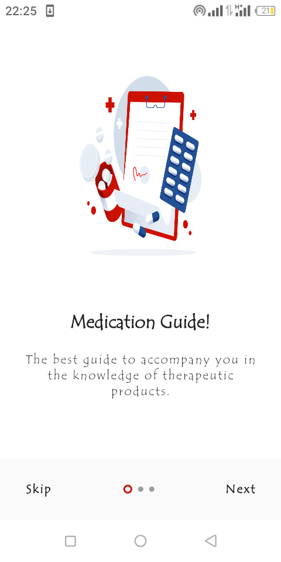
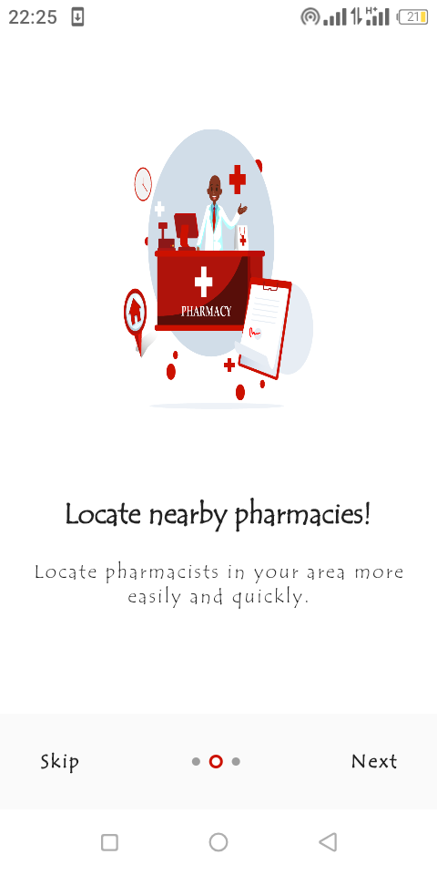
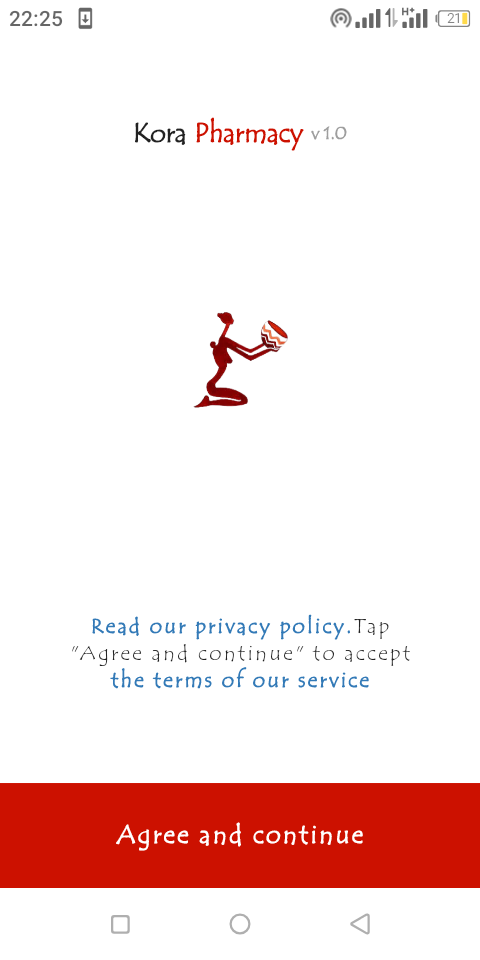
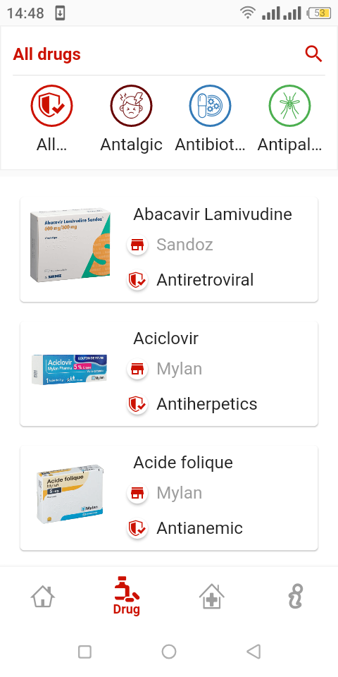
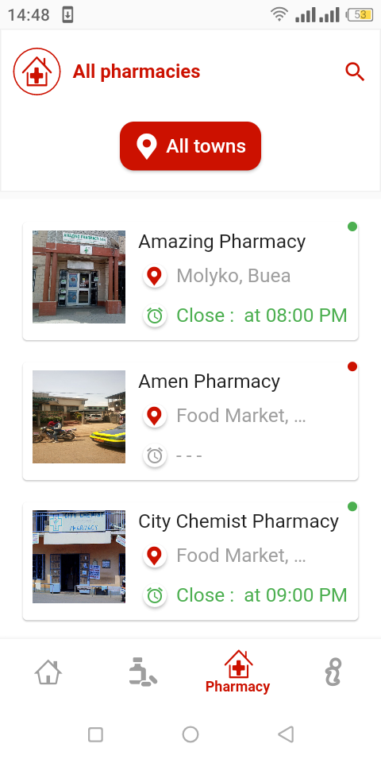
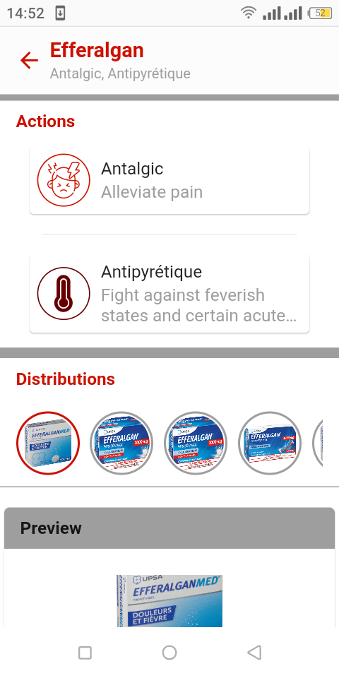
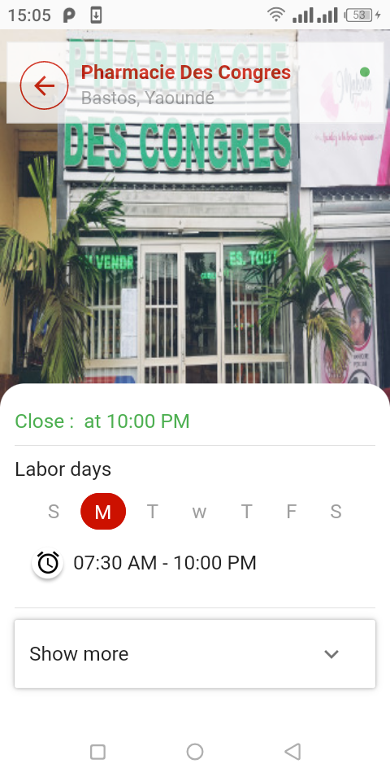

# Mobile

a mobile application allowing a mobile user to view the informations of `data` (the API) from their mobile device

| | | | | |
|:-------------------------:|:-------------------------:|:-------------------------:|:-------------------------:|:-------------------------:|
||||||
|  |  ||  || 

## Functions

***<ins>Drug</ins> :***

    collect informations about drugs and distrution and share them
    list drug by actions, forms

***<ins>Storeg</ins> :***

    collect informations about stores and share them
    list stores by location
    list stores by state : on call, opened or all

