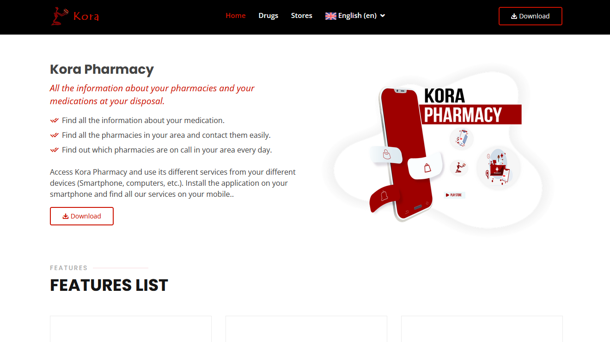
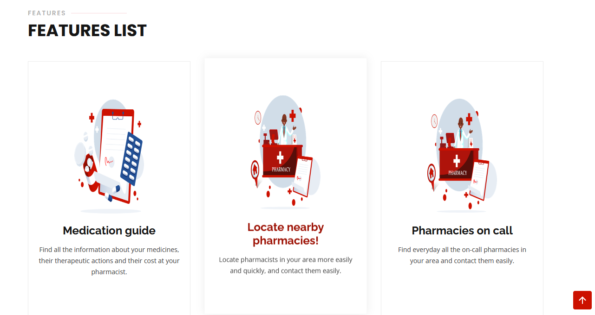
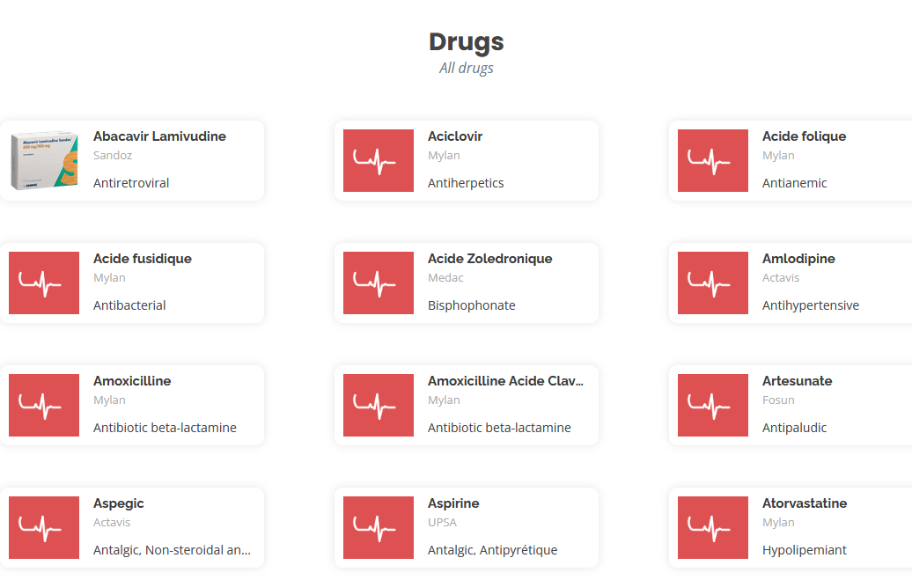
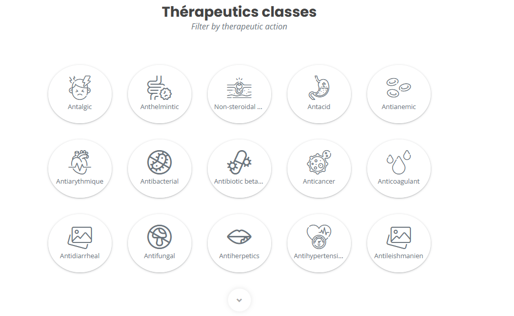
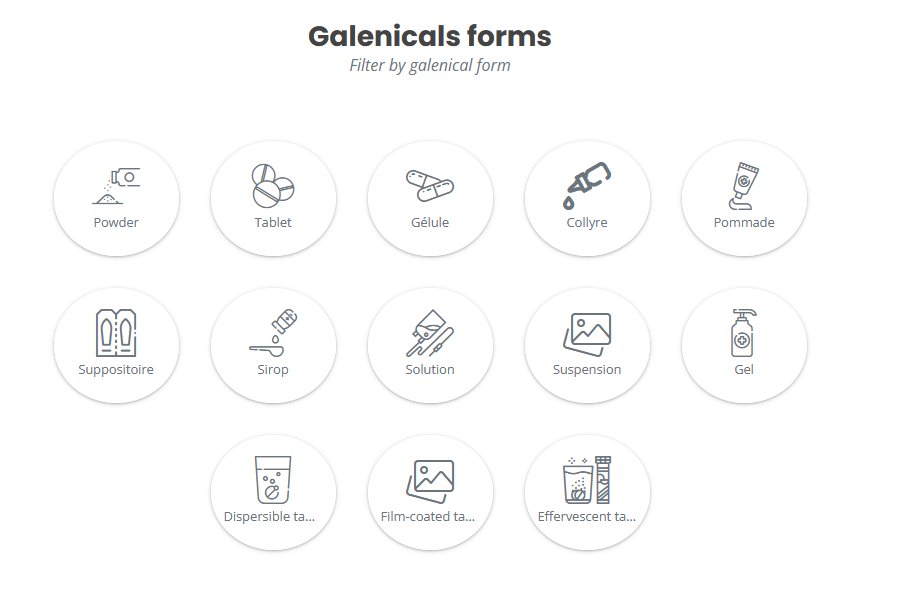
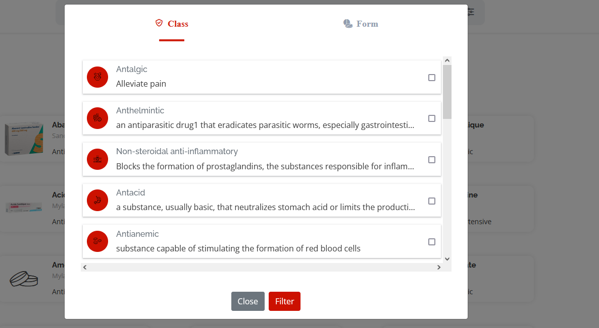
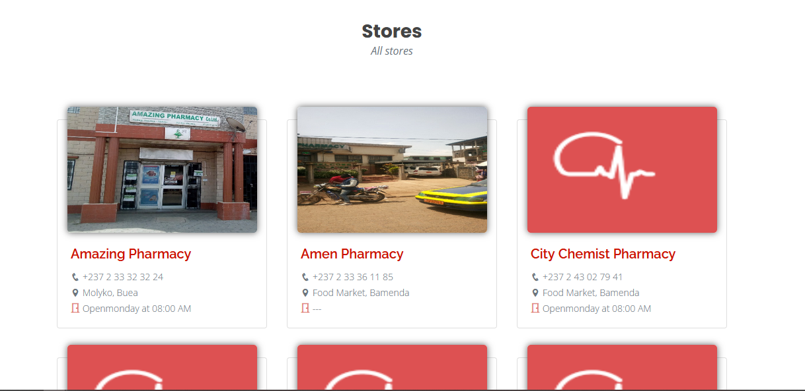
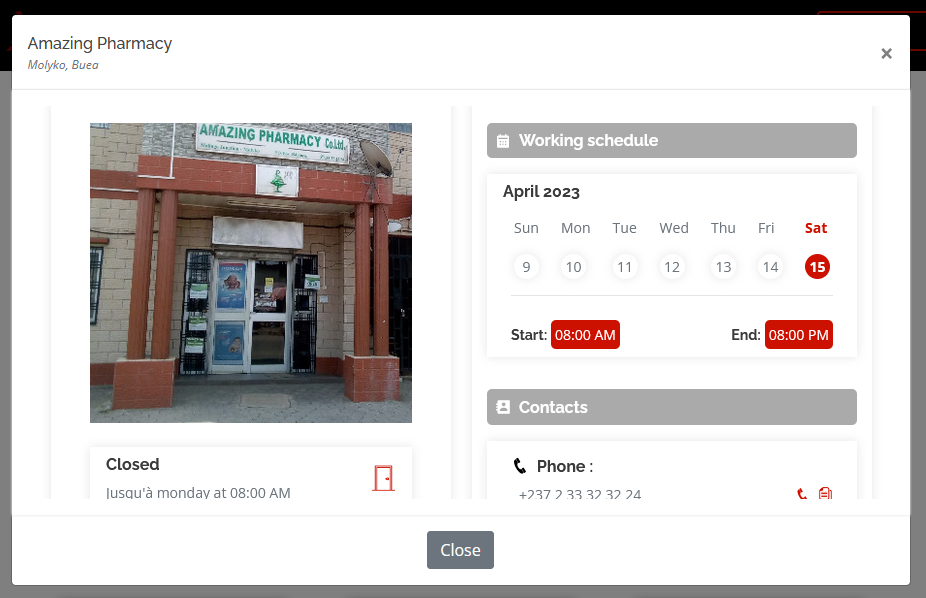
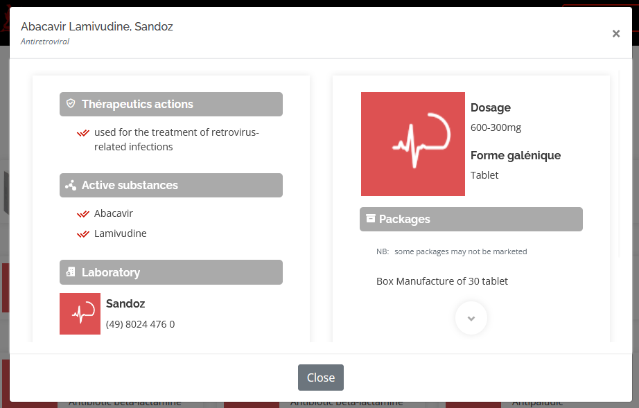

# Doc

## Get started

An interactive web application providing an interface for users to view the informations of `data` (the API) from a web browser

| | | |
|:-------------------------:|:-------------------------:|:-------------------------:|
| |  ||
|  |  || 
||||

## Function

***<ins>Drug</ins> :***
 - [ ] collect informations about drugs and distrution and share them
 - [ ] list drug by name, actions, forms

***<ins>Store</ins> :***
 - [ ] collect informations about stores and share them
 - [ ] list stores by name, location, state (on call, opened or all)
