# Linker

A single page application that interacts with the pharmacy's IS to collect information on medicines and share it with `data` 

**Function** : Collect information relates drug availibility in all drug stores and shared them with `data`

| | | |
|:-------------------------:|:-------------------------:|:-------------------------:|
|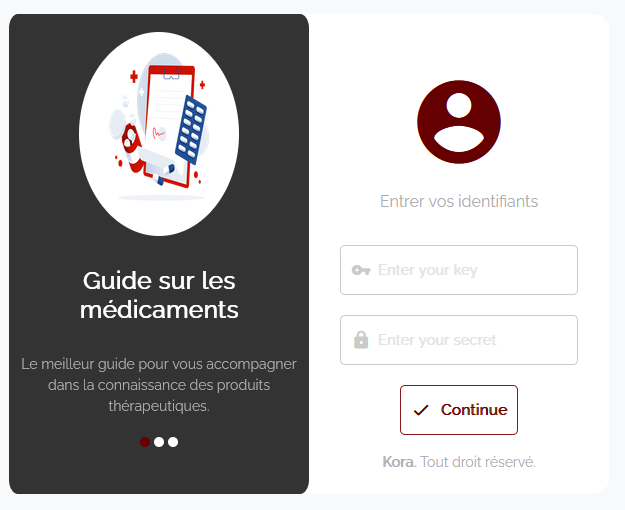 |  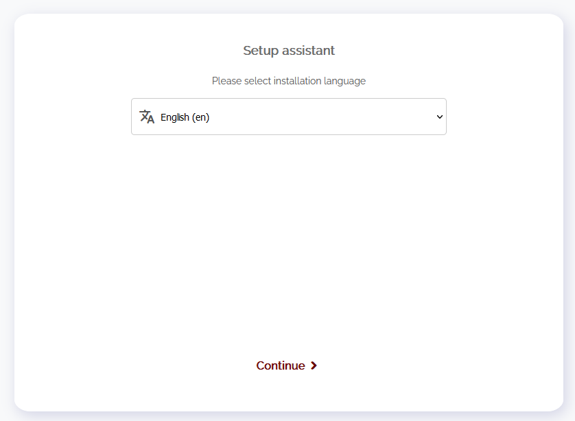 |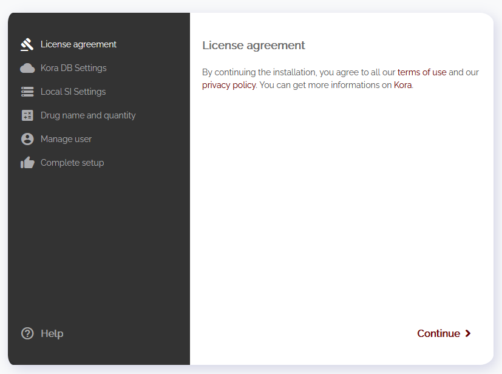 |
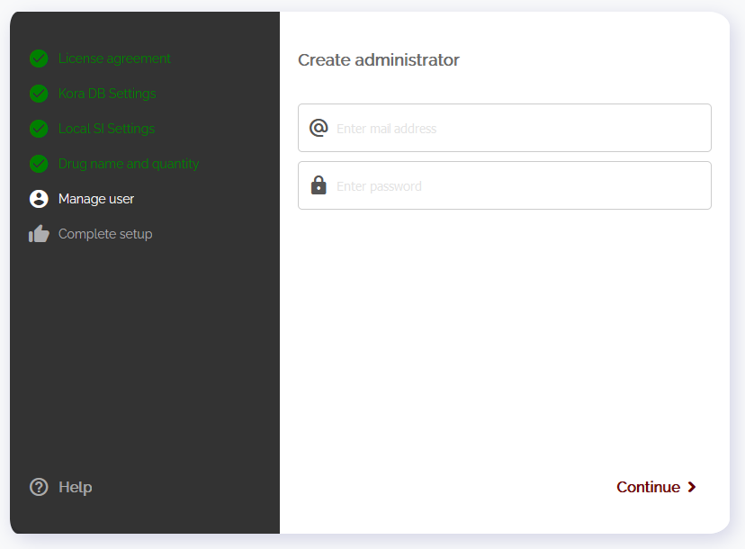  |  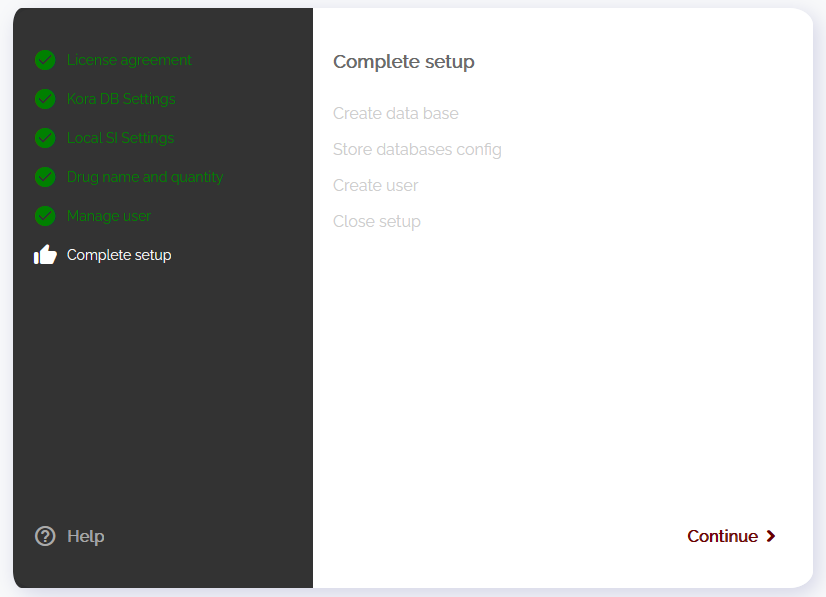|| 
|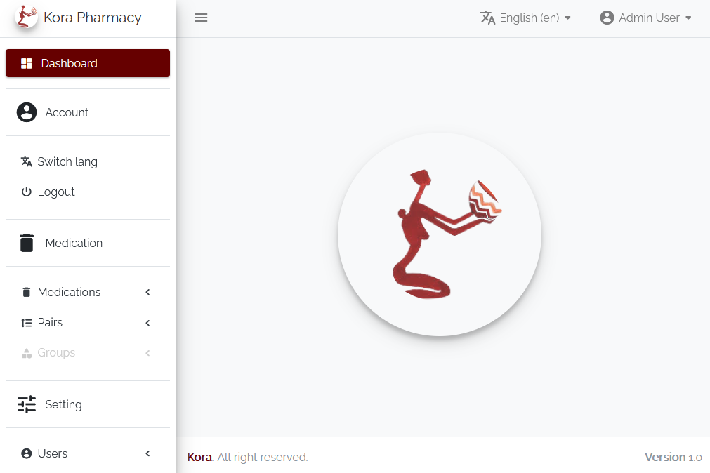|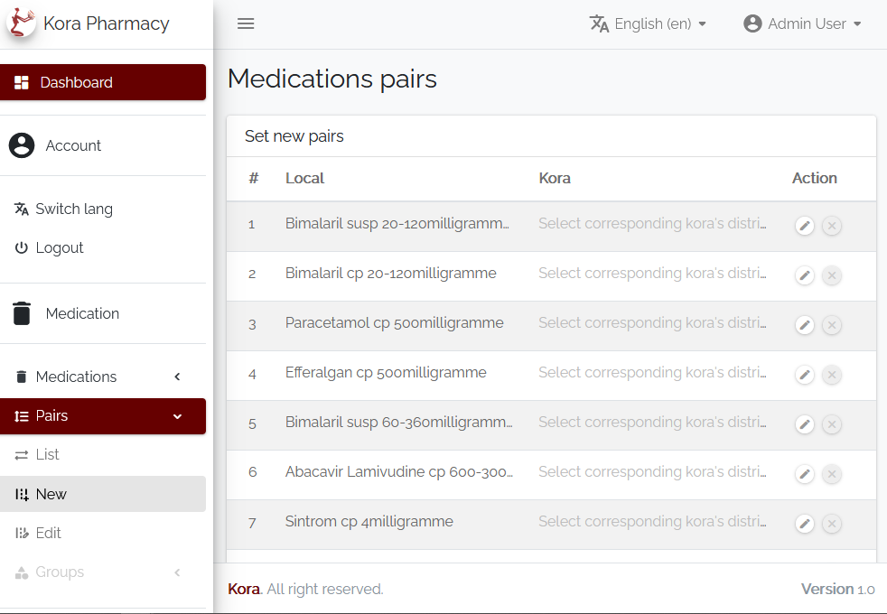|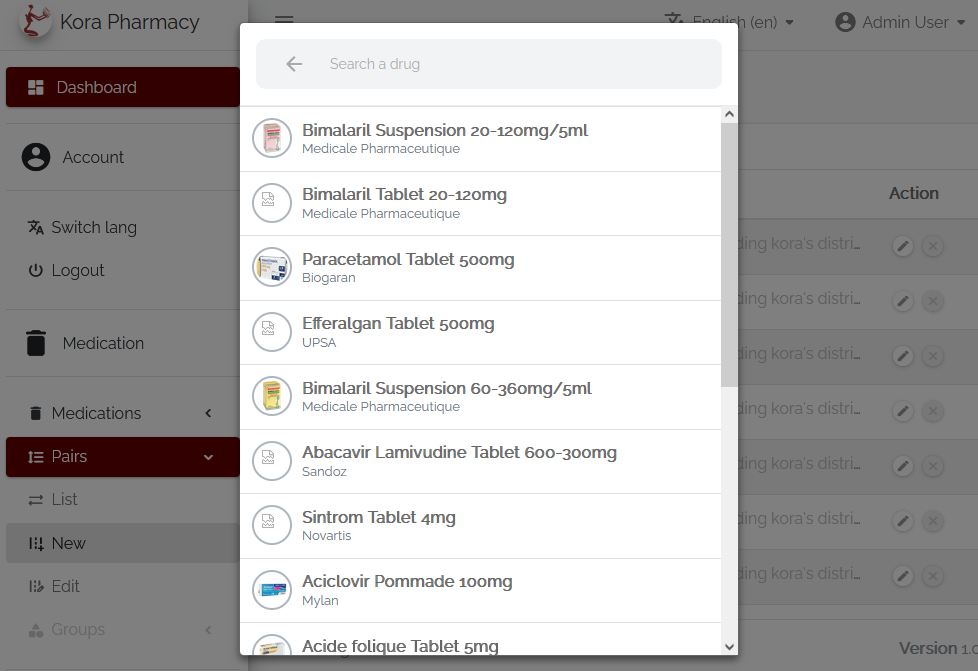|

## Get started

**1. <ins>Setup</ins>**

Deploy `linker` and launch it to start the setup assistant

 | | | |
|:-------------------------:|:-------------------------:|:-------------------------:|
| ***Step 1. Enter the pharmacy API and Secret Keys*** |   ***Step 2. Choose the language to use for and after setup*** | ***Step 3. Accept the terms and conditions to use `linker`*** |
|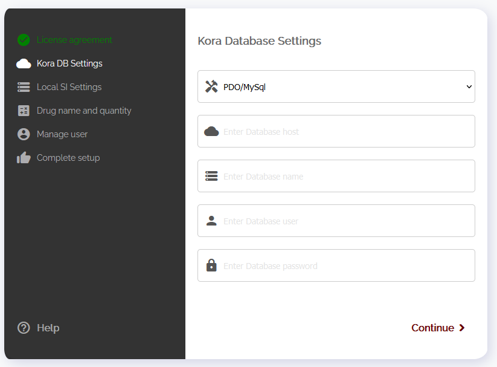 ***Step 4. Set the parameters of the database `linker`     will use*** |  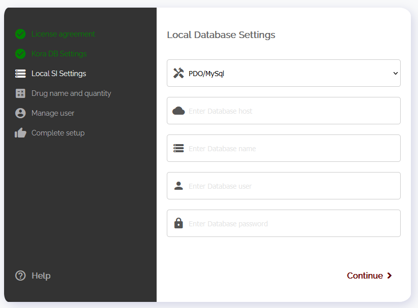 ***Step 5. Set the local SI `linker` will communicate with*** |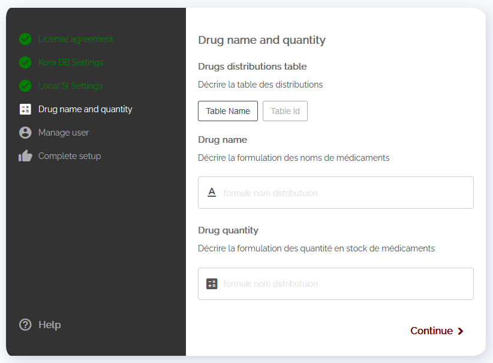 ***Step 6. Set the local distributions config to tell how to get id, name and quantity*** | 
| ***Step 7. Set the administrators credentials to use for login*** | ***Step .8 Continue and wait for the assistant to save config and complete the setup*** | ***Step 9. Fill the form with adminisstrator credentials to log in*** | 

**2. <ins>Dashboard</ins>**

| | | |
|:-------------------------:|:-------------------------:|:-------------------------:|
||||
 
